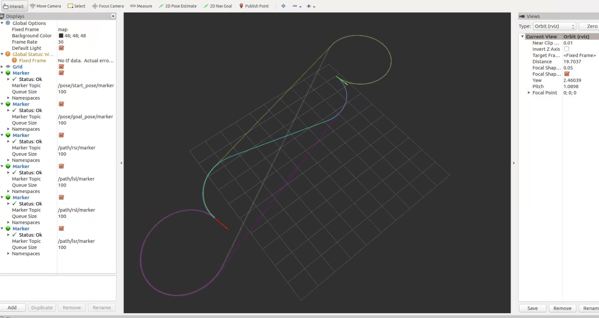

## Dubins Planner Demo

This is a repository for `Dubins Planner Model`. If you want to know more about `Dubins Planner Model`, you can read [this paper](https://bpb-us-e2.wpmucdn.com/faculty.sites.uci.edu/dist/e/700/files/2014/04/Dubins_Set_Robotics_2001.pdf).

### 1. Dubins Planner Model
This is my first ROS project. I hope to become a master of autonomous driving in the future😄.


### 2. Quick Start
```shell
git clone https://github.com/LOTEAT/DubinsPath-Demo.git
cd DubinsPath-Demo
catkin_make
source devel/setup.xxx (depends on your shell)
roslaunch dubins_planner dubins_planner.launch
```

### 3. Result
The result is as follows
<center>
    
    <br>
    <div style="color:orange; border-bottom: 1px solid #d9d9d9;
    display: inline-block;
    color: #999;
    padding: 2px;">
  	</div>
</center>
